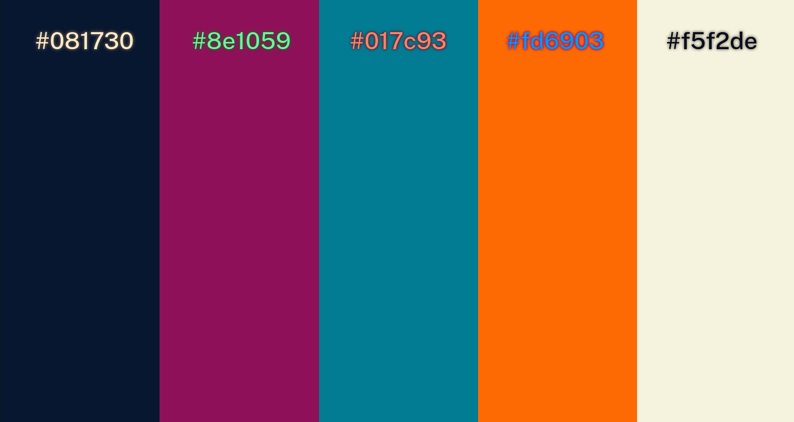
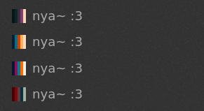

# themeShowcase

themeSchowcase is a very simple webapp that renders colours locally next to each other. I built this to help myself with building themes, I hope that someone finds it helpful some time :)

I run it at [https://theme.haj.gf?](https://theme/haj.gf?081730&8e1059&017c93&fd6903&f5f2de)

Oh and it also renders favicons based on the colours given :3

You may want to put the font PublicSans-Medium as .woff (`PublicSans-Medium.woff`) next to index.html
